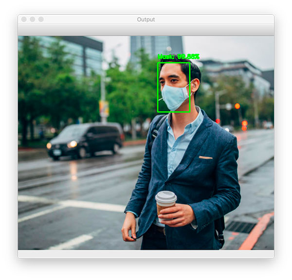
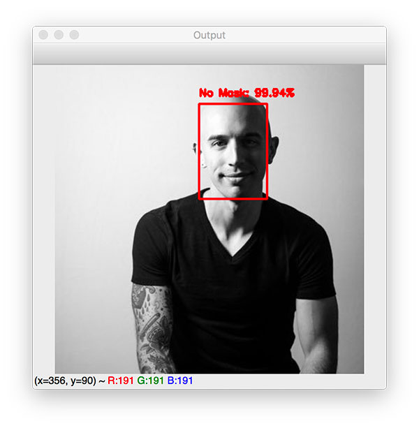
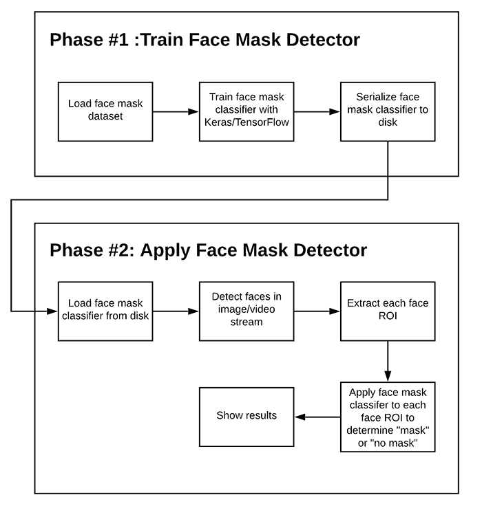

# About
> In this project, we will build a model to detect whether a person is wearing mask in real-time. 
  We will do this using the concepts of computer vision using the OpenCV library and Keras

## Installation

Windows:

```sh
pip install tensorflow
```

## Usage example

This project can be be used in public to detect if the person is wearning the mask or not.

 

## Work stucutre 




## Development setup

To run the code clone the repo and run..

```sh
python train.py
python test.py
```
